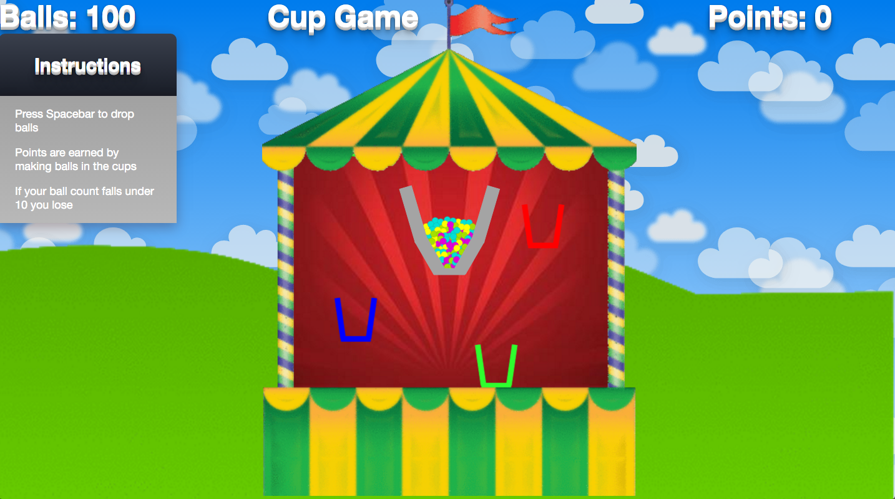

#Cup Game
*Javascript, HTML5, Canvas, Ruby, Rails*

[Cup Game](http://cup-game.herokuapp.com/)

Cup Game is a 2D browser based carnival game.
##Photos

###Game Play

## How to play
The concept behind the game is to fill the cups with as many balls as possible without losing any as they pass under the sieve. Pressing the spacebar dispenses balls.  The speed and number of cups passing under the sieve increases as time passes.

### Bonus Features (To do)
- Make some cups worth more points
- Add a penalty that subtracts points over time
